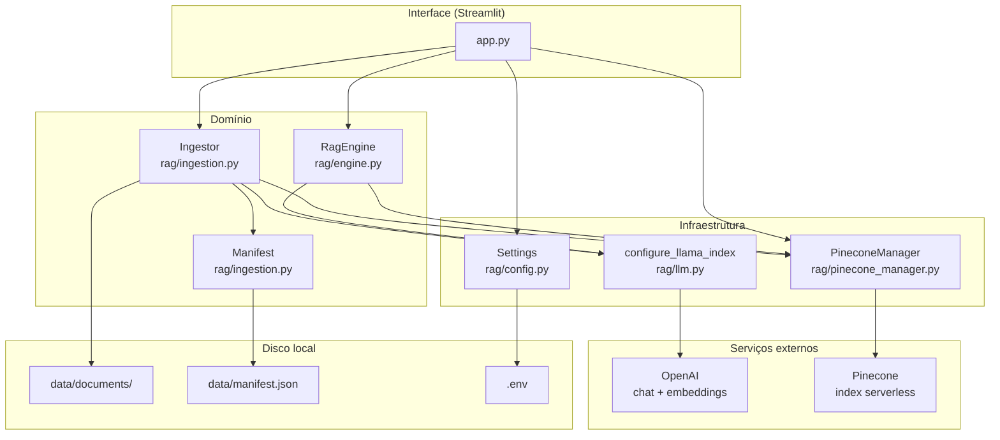
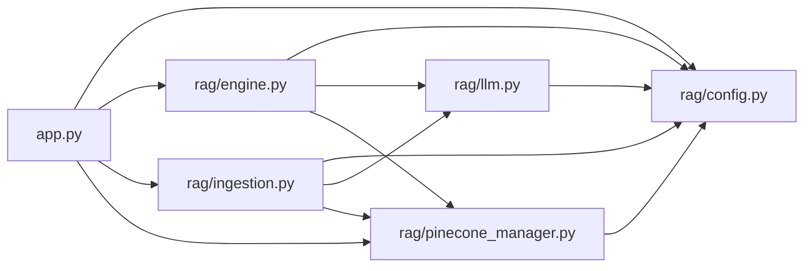
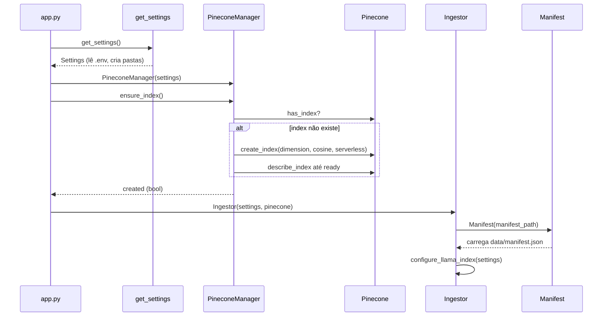
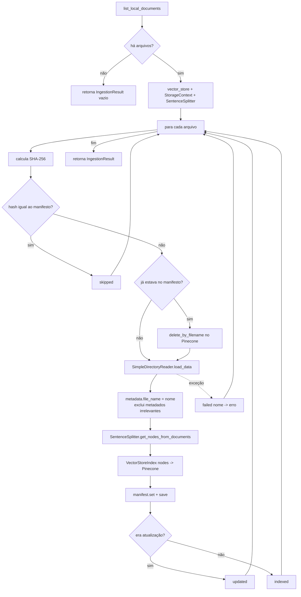
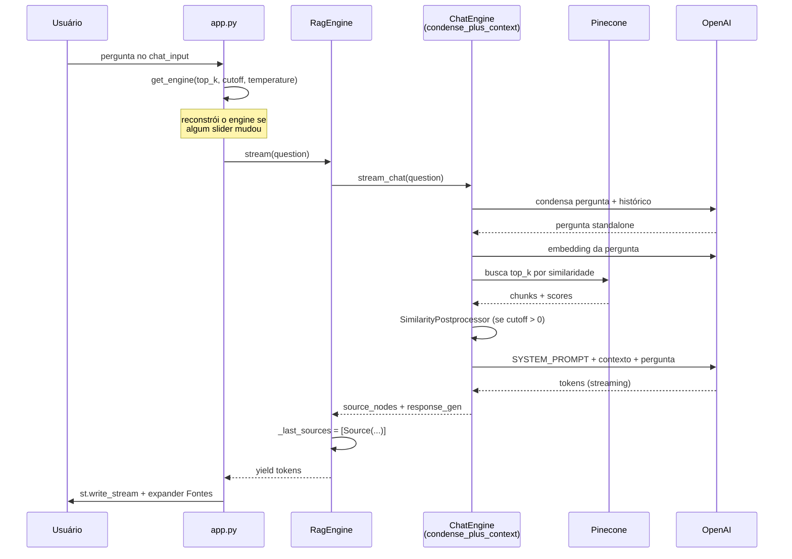

# Arquitetura e referência de código

Este documento descreve como os módulos do projeto se relacionam, os fluxos
principais de execução e o que cada função e classe faz. Para instruções de
instalação e uso, veja o [README](../README.md).

> Os diagramas usam [Mermaid](https://mermaid.js.org/) e são renderizados
> automaticamente pelo GitHub e pela maioria dos editores Markdown.

---

## 1. Visão geral

O sistema é um RAG (Retrieval-Augmented Generation) local com três camadas:

| Camada        | Responsabilidade                                                       | Módulos                       |
|---------------|------------------------------------------------------------------------|-------------------------------|
| Interface     | Upload, sincronização, parâmetros e chat                               | `app.py`                      |
| Domínio       | Ingestão de documentos e motor de consulta                             | `rag/ingestion.py`, `rag/engine.py` |
| Infraestrutura| Configuração, modelos da OpenAI e index no Pinecone                    | `rag/config.py`, `rag/llm.py`, `rag/pinecone_manager.py` |

### Dependências entre módulos

`rag/config.py` é a base: não importa nenhum outro módulo do projeto e é
importado por todos. Não há ciclos de importação.

---

## 2. Fluxos principais

### 2.1 Inicialização

Executada uma única vez por processo, graças ao `st.cache_resource`.

### 2.2 Ingestão (`Ingestor.sync`)

Disparada por "Carregar e indexar", "Sincronizar pasta local" ou
"Reindexar tudo do zero".

### 2.3 Consulta (`RagEngine.stream`)

### 2.4 Estado da sessão Streamlit

| Chave em `st.session_state` | Conteúdo                                                        |
|-----------------------------|-----------------------------------------------------------------|
| `messages`                  | Histórico exibido: `{"role", "content", "sources"}`             |
| `engine`                    | Instância atual de `RagEngine`                                  |
| `engine_key`                | Tupla `(top_k, cutoff, temperature)` usada para criar `engine`  |
| `index_created_notified`    | Evita repetir o toast de "index criado"                         |

---

## 3. Referência de módulos

### 3.1 `app.py` — Interface Streamlit

Página única. Além das três funções abaixo, o módulo executa código de nível
superior que monta a sidebar (status do index, upload, lista de documentos,
sliders, ações) e a área de chat.

| Função | O que faz |
|---|---|
| `load_backend()` | Cacheada com `st.cache_resource`. Chama `get_settings()`, cria o `PineconeManager`, garante o index com `ensure_index()` e instancia o `Ingestor`. Retorna `(settings, pinecone, ingestor, created)`. |
| `build_engine(top_k, cutoff, temperature)` | Cria um `RagEngine` novo com os parâmetros dos sliders. |
| `get_engine(top_k, cutoff, temperature)` | Devolve o engine guardado na sessão; se a tupla de parâmetros mudou, reconstrói via `build_engine` (o que zera a memória da conversa). |

### 3.2 `rag/config.py` — Configuração

Constantes do módulo:

- `BASE_DIR`: raiz do projeto (pai de `rag/`).
- `EMBEDDING_DIMENSIONS`: mapa `modelo -> dimensão` dos embeddings da OpenAI.
- `SUPPORTED_EXTENSIONS`: extensões aceitas na ingestão.

| Item | O que faz |
|---|---|
| `_require(name)` | Lê uma variável de ambiente obrigatória; lança `RuntimeError` se ausente. |
| `Settings` (dataclass, frozen) | Agrupa todos os parâmetros: chaves de API, modelos, index/namespace/cloud/region do Pinecone, chunking, `top_k`, `temperature`, a flag `allow_index_reset` e caminhos locais. Cada campo é preenchido de uma variável de ambiente com default, exceto `OPENAI_API_KEY`, `PINECONE_API_KEY` e `OPENAI_MODEL_NAME`, que são obrigatórias. |
| `Settings.embedding_dimension` (property) | Consulta `EMBEDDING_DIMENSIONS` para o modelo configurado; lança `ValueError` se desconhecido. |
| `_env_flag(name, default=False)` | Lê uma variável de ambiente booleana (`1`/`true`/`yes`/`on`). Usada por `allow_index_reset`, que libera a reindexação destrutiva e fica desligada por padrão. |
| `get_settings()` | Instancia `Settings` e cria `data/documents/` e a pasta do manifesto se não existirem. |

### 3.3 `rag/llm.py` — Modelos globais do LlamaIndex

| Função | O que faz |
|---|---|
| `configure_llama_index(settings, temperature=None)` | Define `LlamaSettings.llm` (OpenAI chat), `LlamaSettings.embed_model` (OpenAI embedding), `chunk_size` e `chunk_overlap` globais. Se `temperature` for `None`, usa `settings.temperature`. Chamada pelo `Ingestor` e pelo `RagEngine` antes de qualquer operação do LlamaIndex. |

### 3.4 `rag/pinecone_manager.py` — Index no Pinecone

| Item | O que faz |
|---|---|
| `PineconeManager(settings)` | Cria o cliente autenticado da API do Pinecone. |
| `index_exists()` | `True` se o index configurado existir na conta. |
| `ensure_index()` | Cria o index serverless (dimensão do embedding, métrica cosseno) se não existir e aguarda até ~60 s ele ficar pronto. Retorna `True` apenas quando cria. |
| `delete_namespace()` | Apaga todos os vetores do namespace, mantendo o index. Ignora 404 de namespace inexistente. |
| `delete_by_filename(file_name)` | Apaga os vetores cujo metadado `file_name` seja igual ao informado. Base da re-indexação e da remoção de documentos. |
| `stats()` | Dicionário com `exists`, `dimension`, `total_vectors` e `namespace_vectors`. Usado nas métricas da sidebar. |
| `vector_store()` | Garante o index e devolve um `PineconeVectorStore` apontando para o namespace, usado tanto na ingestão quanto na consulta. |

### 3.5 `rag/ingestion.py` — Ingestão e manifesto

| Item | O que faz |
|---|---|
| `IngestionResult` (dataclass) | Resultado de `sync`: listas `indexed`, `updated`, `skipped`, dicionário `failed` (`nome -> erro`) e `total_chunks`. |
| `_sha256(path)` | Hash SHA-256 do arquivo, lido em blocos de 1 MiB. |
| `Manifest(path)` | Carrega `data/manifest.json` (ou inicia vazio). Cada entrada guarda `sha256`, `chunks` e `ingested_at`. |
| `Manifest.save()` | Grava o JSON em disco. É o único método que persiste. |
| `Manifest.get(file_name)` | Entrada do arquivo ou `None`. |
| `Manifest.set(file_name, sha, chunks)` | Cria/substitui a entrada com timestamp UTC atual. |
| `Manifest.remove(file_name)` | Remove a entrada, se existir. |
| `Manifest.clear()` | Descarta todas as entradas em memória. |
| `Ingestor(settings, pinecone)` | Carrega o manifesto e chama `configure_llama_index`. |
| `Ingestor.list_local_documents()` | Arquivos de `data/documents/` com extensão suportada, ordenados. |
| `Ingestor.save_uploaded(file_name, content)` | Grava um upload na pasta de documentos usando só o nome base. Não indexa. |
| `Ingestor.remove_document(file_name)` | Apaga o arquivo local, os vetores no Pinecone e a entrada do manifesto. |
| `Ingestor.reset()` | `delete_namespace()` + `manifest.clear()` + `save()`. Mantém os arquivos locais. |
| `Ingestor.sync(chunk_size=None, chunk_overlap=None, progress=None)` | Percorre a pasta, compara hashes com o manifesto e indexa apenas o que é novo ou mudou. Ver fluxo 2.2. |

### 3.6 `rag/engine.py` — Motor de consulta

Constante do módulo:

- `SYSTEM_PROMPT`: instrui o LLM a responder em português do Brasil, usar só o
  contexto, citar o arquivo entre colchetes e não inventar dados.

| Item | O que faz |
|---|---|
| `Source` (dataclass) | Um chunk recuperado: `file_name`, `page`, `score` (3 casas) e `text`. |
| `Answer` (dataclass) | Resposta síncrona: `text` e lista de `Source`. |
| `RagEngine(settings, pinecone, top_k=None, similarity_cutoff=0.0, temperature=None)` | Configura o LlamaIndex, monta `VectorStoreIndex.from_vector_store` sobre o Pinecone, cria um `ChatMemoryBuffer` (4000 tokens) e o chat engine em modo `condense_plus_context`. Adiciona `SimilarityPostprocessor` apenas se `similarity_cutoff > 0`. |
| `RagEngine.ask(question)` | Resposta completa de uma vez; devolve `Answer`. |
| `RagEngine.stream(question)` | Gerador de tokens. Preenche `_last_sources` antes de começar a emitir. É o método usado pela interface. |
| `RagEngine.last_sources` (property) | Fontes da última chamada a `stream()`; lista vazia se ainda não houve. |
| `RagEngine.reset()` | Limpa a memória da conversa. |

---

## 4. Decisões de projeto

- **`file_name` como chave universal.** Todo chunk carrega esse metadado. Ele
  permite apagar seletivamente os vetores de um arquivo (re-indexação e
  remoção) e é o que aparece nas citações. Não remova nem renomeie.
- **Manifesto como fonte de verdade local.** O Pinecone não é consultado para
  saber o que está indexado; o `manifest.json` é. Se o namespace for limpo
  fora da aplicação, use "Reindexar tudo do zero".
- **Um index por modelo de embedding.** A dimensão do index é fixada na
  criação. Trocar `OPENAI_EMBEDDING_MODEL` exige trocar `PINECONE_INDEX_NAME`.
- **Engine reconstruído ao mudar parâmetros.** `top_k`, `similarity_cutoff` e
  `temperature` são fixados no construtor do `RagEngine`. A interface
  reconstrói o engine (e perde a memória) quando qualquer slider muda.
- **Falhas isoladas por arquivo.** `sync` captura exceções por arquivo e
  continua o lote, reportando em `IngestionResult.failed`.
